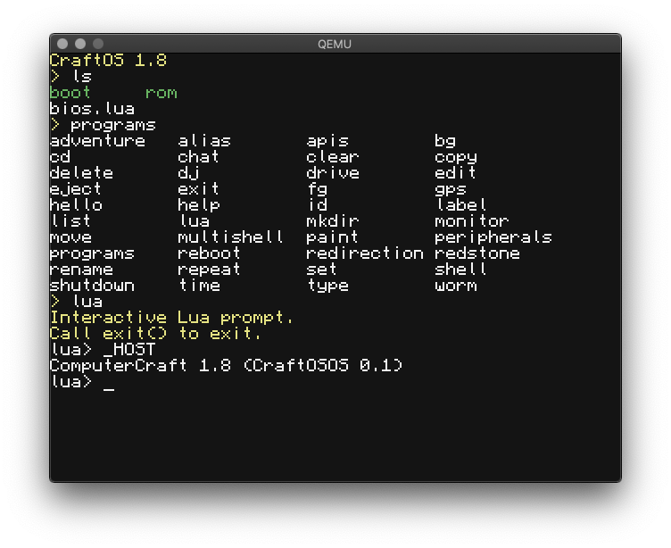

# CraftOS-DOS
ComputerCraft running on MS-DOS/FreeDOS. Mostly emulates ComputerCraft 1.8. Based on [CraftOSOS](https://github.com/MCJack123/CraftOSOS), which is based on [CraftOS-EFI](https://github.com/MCJack123/craftos-efi), which in turn is based on [craftos-native](https://github.com/MCJack123/craftos-native) - this is NOT compatible with [CraftOS-PC](https://github.com/MCJack123/craftos2)!



## Features
* Decent emulation of ComputerCraft 1.80pr1
* 53x26 terminal with proper font and text colors
* Compatibility with real x86 machines - bootable under any 386+ DOS-compatible system

## To-do
* Add HTTP support
* Improve error checking
* Add support for drive peripherals to mount floppy disks or CD/DVDs

## Missing features
* CC: Tweaked/CraftOS-PC features
* Peripheral emulation (maybe something later?)
* Redstone emulation
* USB support

## Usage
The most recent version is available in the Releases tab as an EXE + a disk image (.img) with FreeDOS that can either be booted with a virtual machine like QEMU or VirtualBox (conversion is required for VBox), or written to a real hard drive.

If you decide to use the executable, note that this requires a DPMI (DOS Protected Mode Interface) server to run. On FreeDOS, this is built-in, but for other DOSes, one can be obtained from [here](http://na.mirror.garr.it/mirrors/djgpp/current/v2misc/csdpmi7b.zip). You'll also need the [DOSLFN](http://adoxa.altervista.org/doslfn/) driver to support long file names, which are necessary to load some APIs. Finally, make sure `rom` and `bios.lua` from this repo are present on the C drive of the system.

Unfortunately, there are some issues with various emulation methods:
* DOSBox *refuses* to let CraftOS-DOS run, and will crash with an illegal instruction.
* QEMU works for the most part, but arrow keys do not send the right information, meaning that you can't use them.

### Requirements
* Intel 80386 or better with FPU
* 32 MB RAM
* Monitor and video card that support 16-color 640x480 VGA (this should be standard)
* 5 MB disk space on any medium that the BIOS can detect
* PS/2 keyboard, or a BIOS that supports PS/2 emulation for USB

### Booting with QEMU
To boot the built image with QEMU, run this command:
```
qemu-system-i386 -hda CraftOS-DOS.img
```

### Booting with VirtualBox
First, you'll need to convert the image to a VDI with `VBoxManage`:
```
VBoxManage convertfromraw CraftOSOS.img CraftOSOS.vdi --format VDI
```
Then create an Other OS VM using the VDI created earlier.

### Installing on a real system
Connect a hard drive or USB disk (provided your system can emulate USB as IDE), and flash the IMG file to the entire disk (NOT a partition!). On Windows, Rufus should work fine for this. On Mac or Linux, you can run this command:
```
sudo dd if=CraftOSOS.img of=/dev/<disk> bs=512
```
where `<disk>` is the name of the disk's block device, found on Mac with `diskutil list` and on Linux with `lsblk`. Then connect the boot medium to the target system. Finally, boot to the drive normally.

## Compiling
### Requirements
* [djgpp](http://www.delorie.com/djgpp/) C compiler

### Building
From the repository root:
```sh
# only needed on first clone
git submodule update --init --recursive
cd craftos2-lua
patch -p1 < ../craftos2-lua.patch
cd ..

CC=i686-pc-msdosdjgpp-gcc MYAR="i686-pc-msdosdjgpp-ar rcu" RANLIB=i686-pc-msdosdjgpp-ranlib make -C craftos2-lua generic
i686-pc-msdosdjgpp-gcc -o craftos.exe -Icraftos2-lua/include -g fs_handle.c fs.c lib.c main.c os.c queue.c term.c craftos2-lua/src/liblua.a
```

The built executable is at `craftos.exe`.